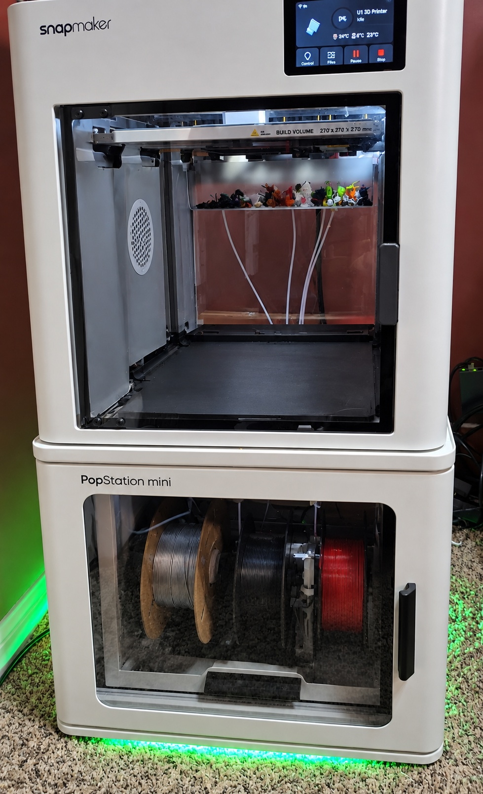
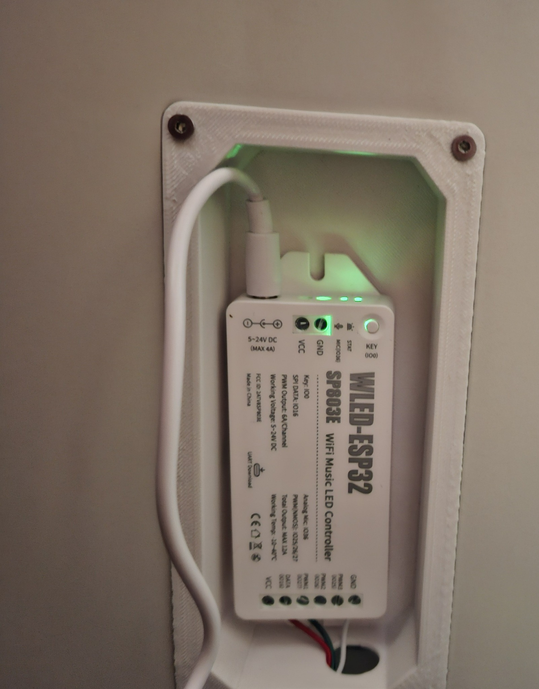
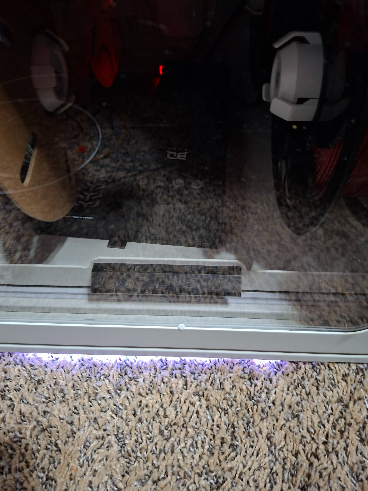
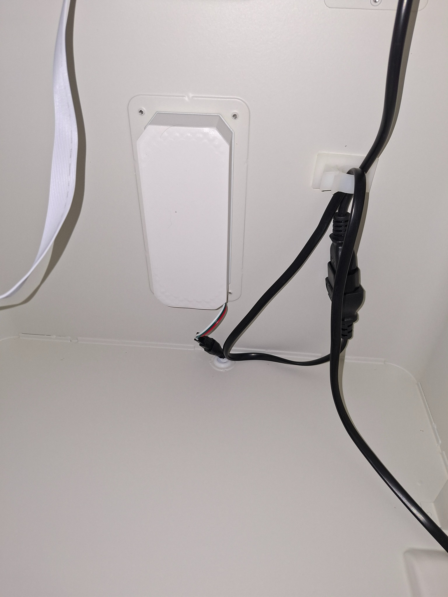

# Snapmaker U1 WLED Status Bridge

> **Open-source U1 modification:** real-time WLED status lighting driven directly by the Snapmaker U1. No Raspberry Pi, Home Assistant server, cloud service, or always-on PC is required after installation.

[Quick Start](QUICKSTART.md) | [v1.0.1 Release](https://github.com/Dr-Hack-N-Sniff/SnapMaker-U1-Status-light/releases/tag/v1.0.1) | [Changelog](CHANGELOG.md)

## Project at a glance

This project turns a network-connected WLED strip into a live status indicator for the Snapmaker U1. A lightweight Python bridge runs **on the printer**, reads local Moonraker state, and translates heater, print, pause, completion, cancellation, and error conditions into visible lighting patterns.

### Why this project matters

- **No extra computer required:** the bridge runs directly on the U1.
- **Uses existing U1 telemetry:** Moonraker provides printer state, print progress, bed temperature, and all four hotend temperatures.
- **Useful at a glance:** the operator can see warm-up, printing, pause, completion, and error states from across the room.
- **Progress without a screen:** green breathing speed increases as the print advances.
- **Boot tolerant:** temporary Moonraker or Wi-Fi/WLED startup failures are retried automatically.
- **Firmware recoverable:** the repository includes a repair workflow for restoring the startup integration after firmware updates.
- **Open and reproducible:** installation, service management, tests, troubleshooting, and recovery steps are documented in this repository.

## Hardware validation

The project has been tested on a real Snapmaker U1, including:

- Standby / idle indication
- Heated bed warm-up
- Extruder 0, 1, 2, and 3 warm-up
- Combined bed + hotend warm-up
- Initial print warm-up transitioning into printing
- Progress-dependent green breathing
- Pause, complete, cancel, and error behaviors
- Cold-boot autostart
- WLED retry after network startup delay
- Moonraker startup delay handling
- Firmware-repair script execution

A tested warm-up sequence was:

```text
standby -> heating_both -> heating_bed -> printing
```

## Demo

### Video Demonstration

See the WLED Status Bridge running on an actual Snapmaker U1:

[▶ Watch the U1 WLED Status Bridge Demo](./Snapmaker_U1_WLED_Forum_Demo_under25MB.mp4)

The demonstration shows the status lighting responding to the printer in real time.

### Tested Installation

This project is running on a Snapmaker U1 with a BIQU PopStation Mini.

The WLED controller is installed inside the PopStation Mini, with the addressable LED strip mounted along the lower edge. This makes the printer state visible from across the room without needing to check the U1 screen.

The tested installation uses:

- Snapmaker U1
- BIQU PopStation Mini
- WLED ESP32 controller
- Approximately 3 ft of addressable RGB LED strip
- 20 LEDs configured in WLED
- WLED 0.16.x

### Status Lighting

| U1 State | WLED Behavior |
|---|---|
| Idle | White breathing |
| Bed heating | Deep orange breathing |
| Hotend heating | Red-orange breathing |
| Bed + hotend heating | Orange-red breathing |
| Printing | Green breathing |
| Paused | Yellow/orange breathing |
| Complete | Solid green for about 30 seconds |
| Cancelled | Solid red |
| Error | Fast red |

During printing, the green breathing rate increases as the print progresses:

| Print Progress | Breathing Speed |
|---|---:|
| 0-24% | 45 |
| 25-49% | 75 |
| 50-74% | 110 |
| 75-89% | 150 |
| 90-100% | 200 |

### Installation Photos

#### Complete Installation



The completed Snapmaker U1 and BIQU PopStation Mini installation with the WLED status lighting active.

#### WLED Controller



The WLED ESP32 controller installed in its recessed enclosure inside the PopStation Mini.

#### LED Strip Installation



The addressable RGB LED strip mounted along the lower edge of the PopStation Mini.

#### Finished Controller Installation



The finished controller enclosure and wiring installation with the controller protected by its cover.

> The PopStation Mini is not required. It is simply where I chose to install the controller and LED strip. The software should work with other WLED-compatible installations.

---

A lightweight status-light bridge that runs **directly on the Snapmaker U1** and controls a WLED strip over the local network.

No Windows PC, Raspberry Pi, Home Assistant server, or third-party Python packages are required once installed.

## v1.0.1 changes

- Initial print warm-up now overrides the green printing indication until commanded heaters reach target.
- Heating colors are more distinct: bed = deeper orange, hotend = redder red-orange, bed + hotend = stronger orange-red.
- Normal heater recovery after warm-up stays green to avoid color flicker during long prints.
- The included `S62u1-wled` service supports `start`, `stop`, `restart`, and `status`.

> **Tested setup:** Snapmaker U1 with root SSH access, Python 3.11, Moonraker on the U1, and a WLED controller on the same LAN.

---

## What it does

The U1 reads its own Moonraker status and sends WLED JSON commands over HTTP.

```text
Snapmaker U1
    |
    | Local Moonraker API
    v
u1_wled.py
    |
    | HTTP / WLED JSON API
    v
WLED controller
    |
    v
LED strip / PopStation underglow
```

### LED meanings

| Condition | LED behavior |
|---|---|
| Standby / idle | White breathing |
| Bed heating | Orange breathing |
| Any hotend heating | Red-orange breathing |
| Bed + hotend heating | Faster orange/red breathing |
| Printing 0-24% | Green, slow breathing |
| Printing 25-49% | Green, faster breathing |
| Printing 50-74% | Green, medium-fast breathing |
| Printing 75-89% | Green, fast breathing |
| Printing 90-100% | Green, very fast breathing |
| Paused | Yellow/orange breathing |
| Complete | Solid green for 30 seconds |
| After complete | White breathing |
| Cancelled | Solid red |
| Error | Fast red effect |

The print-progress effect uses the whole strip instead of a literal progress bar. This works well when part of the strip is hidden underneath a PopStation or enclosure.

---

# Quick install

## Before you start

You need:

- Snapmaker U1 with working root SSH access.
- WLED controller on the same network as the U1.
- WLED configured with the correct LED count.
- The WLED controller should ideally have a DHCP reservation or static IP.
- A copy of this repository on your computer.

This project modifies the U1 startup environment under `/etc/init.d`. Read the firmware-update section before installing.

---

## Step 1 - Find the U1 and WLED IP addresses

Example used during development:

```text
U1:   YOUR_U1_IP
WLED: YOUR_WLED_IP
```

Your addresses may be different.

Test SSH from Windows Command Prompt or PowerShell:

```cmd
ssh root@YOUR_U1_IP
```

Replace `YOUR_U1_IP` with your U1 address.

---

## Step 2 - Verify Moonraker on the U1

After SSHing into the U1, run:

```sh
wget -qO- "http://127.0.0.1:7125/printer/objects/query?print_stats"
```

You should receive JSON containing `print_stats`.

Check Python:

```sh
python3 --version
```

The tested printer reported Python 3.11.8.

No `pip install` is needed. The bridge only uses Python standard-library modules.

---

## Step 3 - Verify WLED from the U1

Still in SSH, run:

```sh
wget -qO- "http://YOUR_WLED_IP/json/info"
```

Replace `YOUR_WLED_IP` with your WLED address.

If it works, WLED will return JSON describing the controller.

If it fails, fix network connectivity before continuing.

---

## Step 4 - Set your WLED address in `u1_wled.py`

On your computer, open:

```text
u1_wled.py
```

Find:

```python
WLED = "http://YOUR_WLED_IP"
```

Change it to your WLED controller's address.

Do not change the Moonraker address unless your U1 is configured differently:

```python
MOONRAKER = "http://127.0.0.1:7125"
```

---

## Step 5 - Create the project directory on the U1

SSH into the U1 and run:

```sh
mkdir -p /oem/printer_data/u1_wled
```

Leave this SSH window open.

---

## Step 6 - Copy the project files to the U1

Open a **second** Windows Command Prompt or PowerShell in the downloaded repository folder.

Run:

```cmd
scp u1_wled.py S62u1-wled install.sh repair.sh uninstall.sh status.sh root@YOUR_U1_IP:/oem/printer_data/u1_wled/
```

Replace `YOUR_U1_IP` with your U1 address.

---

## Step 7 - Run the installer

Back in the U1 SSH session:

```sh
chmod +x /oem/printer_data/u1_wled/*.sh
chmod +x /oem/printer_data/u1_wled/S62u1-wled
chmod +x /oem/printer_data/u1_wled/u1_wled.py
```

Then run:

```sh
/oem/printer_data/u1_wled/install.sh
```

Expected output should end with something similar to:

```text
U1 WLED IS RUNNING
Install complete.
```

---

## Step 8 - Check the service

Run:

```sh
/etc/init.d/S62u1-wled status
```

Expected:

```text
U1 WLED IS RUNNING
```

You can also use the included status helper:

```sh
/oem/printer_data/u1_wled/status.sh
```

It displays both service status and recent log entries.

---

## Step 9 - Reboot test

Before rebooting, make the test obvious by setting WLED to a color that is **not** one of the normal standby states.

For example, set it to solid purple from the WLED web interface.

Then reboot the U1:

```sh
reboot
```

Do not manually start the bridge after reboot.

Wait for the U1 and Wi-Fi to finish starting.

If the printer is idle, the strip should change from purple to **white breathing** automatically.

That proves the bridge started on the U1 and overwrote WLED's remembered state.

After SSH reconnects, verify:

```sh
/etc/init.d/S62u1-wled status
```

And check the log:

```sh
tail -n 30 /oem/printer_data/u1_wled/u1_wled.log
```

---

# Test the heater states

The U1 exposes:

```text
heater_bed
extruder
extruder1
extruder2
extruder3
```

To inspect them manually:

```sh
wget -qO- "http://127.0.0.1:7125/printer/objects/query?heater_bed&extruder&extruder1&extruder2&extruder3"
```

The bridge reads each heater's `temperature` and `target` values.

Test each one from the U1 screen:

1. Start with the printer idle. The LEDs should be white breathing.
2. Set a bed temperature. The LEDs should turn orange and breathe.
3. Set the bed target back to 0. The LEDs should return to white.
4. Heat Extruder 0. Verify heating indication.
5. Repeat for Extruders 1, 2, and 3.
6. Heat the bed and a hotend together. The breathing effect should be faster.

A 2 C tolerance is used to prevent tiny temperature fluctuations near the target from constantly changing the status.

---

# Test printing and progress

During a print, the bridge queries:

```text
virtual_sdcard.progress
```

and changes the breathing speed at these progress points:

```text
0-24%    speed 45
25-49%   speed 75
50-74%   speed 110
75-89%   speed 150
90-100%  speed 200
```

Typical log entries:

```text
Printer state: None -> printing
WLED -> PRINTING | 13% | breathe speed 45
WLED -> PRINTING | 25% | breathe speed 75
```

The bridge only changes the print effect when the printer changes progress buckets, so it is not continuously sending unnecessary WLED commands every second.

---

# Complete behavior

When a running bridge observes a print transition into `complete`:

```text
Printing -> Complete -> Solid green for 30 seconds -> White breathing
```

Moonraker can retain a stale `complete` state long after a print ends. The bridge therefore does two things:

1. It only starts the 30-second completion celebration when it observes a real transition into `complete` while running.
2. If the bridge starts and Moonraker already says `complete`, it treats that as stale and goes to idle/heating instead of falsely showing a newly completed print.

---

# Why the bridge runs directly on the U1

An early version ran on a Windows computer. That worked, but the computer had to remain powered on.

The final design runs on the U1 itself:

```text
U1 -> local Moonraker -> Python bridge -> LAN -> WLED
```

That removes the PC dependency entirely.

---

# Why no `requests` package is installed

The U1 had Python 3 available, but did not have the third-party `requests` package.

Instead of modifying the printer's Python environment with `pip`, this bridge uses:

```python
urllib.request
urllib.error
```

These are part of Python's standard library.

This keeps the modification isolated and avoids changing Snapmaker's Python package environment.

---

# Persistent file location

The tested U1 showed:

```text
/home/lava/printer_data -> /oem/printer_data
```

and `/oem` was a writable ext4 partition.

Project files are therefore kept here:

```text
/oem/printer_data/u1_wled/
```

Typical installed files:

```text
/oem/printer_data/u1_wled/
├── u1_wled.py
├── u1_wled.log
├── S62u1-wled
├── install.sh
├── repair.sh
├── uninstall.sh
├── status.sh
└── backups/
```

---

# How autostart works

The tested U1 uses BusyBox init.

`/etc/inittab` starts:

```text
/etc/init.d/rcS
```

and `rcS` starts scripts matching:

```text
/etc/init.d/S??*
```

The U1 already has startup scripts including:

```text
S60klipper
S61moonraker
```

This project installs:

```text
/etc/init.d/S62u1-wled
```

However, on the tested U1, simply adding a new `S62` file was not enough for a reliable cold-boot start because of the overlay/startup timing.

The installer therefore adds exactly one launcher line to the **current firmware's existing**:

```text
/etc/init.d/S99_bootcontrol
```

The line is:

```sh
/etc/init.d/S62u1-wled start
```

The installer first verifies that `S99_bootcontrol` ends with `exit 0`, makes a backup, and inserts the hook immediately before the final `exit 0`.

It does **not** replace `S99_bootcontrol` with a copy from another firmware release.

---

# Why `nohup` is used

The service starts the bridge with:

```sh
nohup python3 "$SCRIPT" >> "$LOG" 2>&1 </dev/null &
```

This detaches the Python process from the SSH terminal so ending an SSH session does not terminate the status bridge.

---

# Startup/network retry behavior

The bridge may start before Wi-Fi or Moonraker is completely ready.

During boot you may temporarily see messages such as:

```text
Moonraker error: <urlopen error [Errno 111] Connection refused>
Moonraker unavailable - keeping current WLED status
```

or:

```text
WLED error: <urlopen error [Errno 101] Network is unreachable>
```

Those are not fatal.

If WLED is unavailable, the bridge records that the desired LED state was **not successfully applied** and retries it on later loops. Once Wi-Fi is ready, the correct status is sent automatically.

This behavior is important during reboot because WLED may come online before or after the U1 network interface.

---

# Logs

The bridge log is:

```text
/oem/printer_data/u1_wled/u1_wled.log
```

View recent activity:

```sh
tail -n 50 /oem/printer_data/u1_wled/u1_wled.log
```

Follow the log live:

```sh
tail -f /oem/printer_data/u1_wled/u1_wled.log
```

Press `Ctrl+C` to stop following the log. This does **not** stop the bridge service.

---

# Service commands

Start:

```sh
/etc/init.d/S62u1-wled start
```

Stop:

```sh
/etc/init.d/S62u1-wled stop
```

Restart:

```sh
/etc/init.d/S62u1-wled restart
```

Status:

```sh
/etc/init.d/S62u1-wled status
```

---

# Firmware updates and repair

A Snapmaker firmware update can replace files under `/etc/init.d`.

The project files under `/oem/printer_data/u1_wled` are intentionally kept separate, but the firmware may remove:

```text
/etc/init.d/S62u1-wled
```

or the one-line boot hook in:

```text
/etc/init.d/S99_bootcontrol
```

After a firmware update, SSH into the U1 and run:

```sh
/oem/printer_data/u1_wled/repair.sh
```

The repair script:

1. Uses the **current firmware's** `S99_bootcontrol`.
2. Saves a backup before modifying it.
3. Restores `S62u1-wled` from the persistent project directory.
4. Adds the startup hook only if it is missing.
5. Restarts the bridge.
6. Verifies that the process is alive.

This is intentionally safer than restoring an old complete copy of `S99_bootcontrol`, because a future Snapmaker firmware may legitimately change that file.

After repair, reboot once and perform the purple-to-white test again.

---

# Uninstall

To remove the startup integration while preserving your project files and logs:

```sh
/oem/printer_data/u1_wled/uninstall.sh
```

The uninstaller:

- Stops the bridge.
- Removes the custom line from `S99_bootcontrol`.
- Removes `/etc/init.d/S62u1-wled`.
- Leaves `/oem/printer_data/u1_wled` intact so backups and logs are not destroyed.

If you later decide you want to remove the project files too, review the directory first and then delete it manually.

---

# Troubleshooting

## WLED does not respond

From the U1:

```sh
wget -qO- "http://YOUR_WLED_IP/json/info"
```

If this does not return JSON, check:

- WLED power.
- Wi-Fi connection.
- IP address.
- VLAN/firewall rules.
- Whether the U1 and WLED can reach one another.

---

## Moonraker does not respond

Run:

```sh
wget -qO- "http://127.0.0.1:7125/printer/objects/query?print_stats"
```

If this fails immediately after boot, wait a little longer and try again. Moonraker may still be starting.

---

## Bridge not running

```sh
/etc/init.d/S62u1-wled status
```

If it is not running:

```sh
/etc/init.d/S62u1-wled restart
```

Then inspect:

```sh
tail -n 100 /oem/printer_data/u1_wled/u1_wled.log
```

---

## After a firmware update

Run:

```sh
/oem/printer_data/u1_wled/repair.sh
```

Then:

```sh
/etc/init.d/S62u1-wled status
```

Finally reboot and confirm the bridge takes control of WLED automatically.

---

# Configuration values

The main values you may want to change are near the top of `u1_wled.py`.

### WLED IP

```python
WLED = "http://YOUR_WLED_IP"
```

### Poll interval

```python
POLL_INTERVAL = 1.0
```

### Complete hold time

```python
COMPLETE_HOLD_SECONDS = 30
```

### Heater target tolerance

```python
HEAT_TOLERANCE = 2.0
```

### Brightness

```python
BRI_PRINTING = 180
BRI_PAUSED = 160
BRI_COMPLETE = 180
BRI_ERROR = 180
BRI_IDLE = 45
BRI_HEATING = 165
```

### Printing breathing speeds

The current thresholds are implemented in `status_printing()`:

```text
<25%  = 45
<50%  = 75
<75%  = 110
<90%  = 150
>=90% = 200
```

---

# Status priority

Version 1.0.1 adds an **initial warm-up phase** so heating remains visible after a print is started. The bridge does not immediately switch to green just because Moonraker reports `printing`.

During the initial warm-up:

```text
standby
   |
   v
bed + hotend heating -> orange/red breathing
   |
   v
bed heating only    -> deep orange breathing
   |
   v
all commanded heaters within 2 C of target
   |
   v
printing             -> green progress breathing
```

Pause, cancel, error, and completion states still take priority. Once the initial warm-up has finished, ordinary small temperature recovery during the print does **not** replace the green progress indication. This avoids the status light flickering between green and heating colors throughout a long print.

---

# Tested behaviors

The original installation was manually tested for:

- Standby / white breathing.
- Bed heating.
- Extruder 0 heating.
- Extruder 1 heating.
- Extruder 2 heating.
- Extruder 3 heating.
- Return to idle after heater target is removed.
- Printing status.
- Print progress breathing-speed changes.
- Completion indication.
- 30-second completion-to-idle transition.
- Temporary Moonraker connection failure.
- WLED unavailable during boot.
- Retry after network recovery.
- Service restart.
- Cold reboot autostart.
- WLED remembered-state overwrite after reboot.

---

# Safety and disclaimer

This is an unofficial modification. It is not affiliated with or supported by Snapmaker or the WLED project.

The Python bridge itself is observational: it reads Moonraker status and sends HTTP commands to an independent WLED controller. It does not command motion, heaters, or the print process.

However, installation requires root SSH access and modifies startup files under `/etc/init.d`. Firmware revisions can differ. Back up files before changing them and review the scripts before running them.

The installer and repair script deliberately stop if `S99_bootcontrol` does not match the expected safe patch point rather than blindly modifying an unfamiliar firmware layout.

---

# Repository files

```text
README.md       Full instructions and project documentation
QUICKSTART.md   Short copy/paste installation guide
u1_wled.py      Main status bridge
S62u1-wled      BusyBox init service launcher
install.sh      First-time installation and boot-hook setup
repair.sh       Firmware-update repair tool
uninstall.sh    Removes startup integration
status.sh       Quick service + log status helper
```


---

## License

This project is released under the [MIT License](LICENSE).

