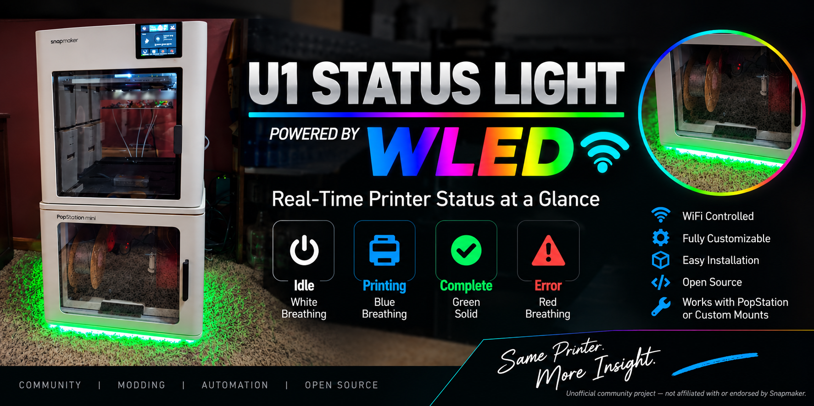

# Snapmaker U1 WLED Status Bridge



> **Unofficial community project — not affiliated with or endorsed by Snapmaker.**

> **Open-source U1 modification:** real-time WLED status lighting driven directly by the Snapmaker U1. No Raspberry Pi, Home Assistant server, cloud service, or always-on PC is required after installation.

[Quick Start](QUICKSTART.md) | [Changelog](CHANGELOG.md) | **Current recommended release: v1.2.1**

## Project at a glance

This project turns a network-connected WLED strip into a live status indicator for the Snapmaker U1. A lightweight Python bridge runs **on the printer**, reads local Moonraker state, and translates heater, print, pause, completion, cancellation, and error conditions into visible lighting patterns.

### Why this project matters

- **No extra computer required:** the bridge runs directly on the U1.
- **Uses existing U1 telemetry:** Moonraker provides printer state, print progress, bed temperature, and all four hotend temperatures.
- **Useful at a glance:** see warm-up, printing, pause, completion, and error states from across the room.
- **Progress without a screen:** green breathing speed increases as the print advances.
- **Boot tolerant:** temporary Moonraker or Wi-Fi/WLED startup failures are retried automatically.
- **Physical-power failsafe:** the U1 sends a heartbeat to WLED so separately powered LEDs shut off if the printer disappears.
- **Firmware recoverable:** installation and repair validate the current firmware configuration before modifying live startup files.
- **Open and reproducible:** installation, service management, tests, troubleshooting, and recovery are documented.

## Hardware validation

The project has been tested on a real Snapmaker U1, including:

- Standby / idle indication
- Heated bed warm-up
- Extruder 0, 1, 2, and 3 warm-up
- Combined bed + hotend warm-up
- Initial print warm-up transitioning into printing
- Progress-dependent green breathing
- Pause, complete, cancel, and error behaviors
- Cold-boot autostart
- WLED retry after network startup delay
- Moonraker startup delay handling
- Firmware-repair script execution
- Shutdown OFF behavior
- Reboot OFF -> boot -> status recovery
- Software poweroff and cold-start recovery
- Heartbeat every 3 seconds
- Watchdog timeout after about 10 seconds without heartbeat
- Physical power-switch OFF -> LEDs OFF
- Power-on -> heartbeat/status recovery
- v1.2.1 install and repair safety behavior
- Coexistence with a separate Snapmaker U1 Fluidd camera bridge

A tested warm-up sequence was:

```text
standby -> heating_both -> heating_bed -> printing
```

## Demo

### Video Demonstration

See the WLED Status Bridge running on an actual Snapmaker U1:

[▶ Watch the U1 WLED Status Bridge Demo](./Snapmaker_U1_WLED_Forum_Demo_under25MB.mp4)

The demonstration shows the status lighting responding to the printer in real time.

### Tested Installation

This project is running on a Snapmaker U1 with a BIQU PopStation Mini.

The WLED controller is installed inside the PopStation Mini, with the addressable LED strip mounted along the lower edge. This makes printer state visible from across the room without needing to check the U1 screen.

The tested installation uses:

- Snapmaker U1
- BIQU PopStation Mini
- WLED ESP32 controller
- Approximately 3 ft of addressable RGB LED strip
- 20 LEDs configured in WLED
- WLED 0.16.x

### Status Lighting

| U1 State | WLED Behavior |
|---|---|
| Idle | White breathing |
| Bed heating | Deep orange breathing |
| Hotend heating | Red-orange breathing |
| Bed + hotend heating | Orange-red breathing |
| Printing | Green breathing |
| Paused | Yellow/orange breathing |
| Complete | Solid green for about 30 seconds |
| Cancelled | Solid red |
| Error | Fast red |

During printing, the green breathing rate increases as the print progresses:

| Print Progress | Breathing Speed |
|---|---:|
| 0-24% | 45 |
| 25-49% | 75 |
| 50-74% | 110 |
| 75-89% | 150 |
| 90-100% | 200 |

#### Complete U1 Installation

The completed Snapmaker U1 setup with the WLED status lighting installed.


#### WLED Controller

The ESP32 WLED controller mounted in the installation.


#### Controller Installation and Wiring

The controller installation showing the wiring and connections.


#### LED Strip Installation

The addressable LED strip installed along the bottom edge of the U1.


> The PopStation Mini is not required. It is simply where I chose to install the controller and LED strip. The software should work with other WLED-compatible installations.

---

## v1.2.1 - recommended

v1.2.1 is a maintenance and recovery-safety release.

The WLED status behavior, heartbeat protocol, and included watchdog firmware are unchanged from v1.2.0.

The major change is safer handling of the Snapmaker startup configuration.

Installation, repair, and uninstall now follow:

**Detect -> Validate -> Back up -> Modify**

Before changing live startup files, the tools create and validate a proposed copy of the current firmware's `S99_bootcontrol`.

If a future Snapmaker firmware changes the expected boot layout, the operation stops instead of blindly forcing an older configuration.

v1.2.1 also:

- Validates service scripts before installing them.
- Backs up the current boot configuration before modification.
- Preserves unrelated startup entries.
- Removes only WLED-specific hooks during uninstall.
- Never restores an old full `S99_bootcontrol`.
- Includes regression testing for preservation of unrelated hooks such as `S64u1-camera`.
- Passed the complete 16-test automated test suite.
- Was physically tested on a Snapmaker U1.

### v1.2.0 heartbeat/watchdog

v1.2.0 introduced the physical-power failsafe:

- The U1 sends a lightweight heartbeat every 3 seconds.
- The included WLED firmware turns the LEDs off after about 10 seconds without a heartbeat.
- Physical U1 power-switch shutdown is handled even when WLED has its own power supply.
- On power-up, both U1 services start automatically and normal status lighting returns.
- The heartbeat runs as a separate service so it remains isolated from the printer-status bridge.

### WLED firmware installation

The required `firmware.bin` is included in the release.

Back up your WLED configuration and presets, then open:

**Config -> Security & Updates -> Update WLED**

Select `firmware.bin` and upload it.

On the tested OTA-capable controller, no USB connection, programmer, PlatformIO, or firmware compiling is required.

> **Already running v1.2.0?** The watchdog firmware is unchanged in v1.2.1. You do not need to re-flash WLED solely to upgrade the Snapmaker-side scripts to v1.2.1.

### Previous releases

v1.2.0 remains available as the previous heartbeat/watchdog release and rollback point.

v1.1.0 remains available as the previous pre-watchdog release.

---

## What it does

The U1 reads its own Moonraker status and sends WLED JSON commands over HTTP.

```text
Snapmaker U1
    |
    | Local Moonraker API
    v
u1_wled.py
    |
    | HTTP / WLED JSON API
    v
WLED controller
    |
    v
LED strip / PopStation underglow
```

A separate heartbeat service sends a small UDP heartbeat to the WLED watchdog firmware.

```text
Snapmaker U1
    |
    | UDP heartbeat every 3 seconds
    v
WLED watchdog
    |
    | heartbeat disappears
    v
LEDs OFF after approximately 10 seconds
```

### LED meanings

| Condition | LED behavior |
|---|---|
| Standby / idle | White breathing |
| Bed heating | Orange breathing |
| Any hotend heating | Red-orange breathing |
| Bed + hotend heating | Faster orange/red breathing |
| Printing 0-24% | Green, slow breathing |
| Printing 25-49% | Green, faster breathing |
| Printing 50-74% | Green, medium-fast breathing |
| Printing 75-89% | Green, fast breathing |
| Printing 90-100% | Green, very fast breathing |
| Paused | Yellow/orange breathing |
| Complete | Solid green for 30 seconds |
| After complete | White breathing |
| Cancelled | Solid red |
| Error | Fast red effect |

The print-progress effect uses the whole strip instead of a literal progress bar. This works well when part of the strip is hidden underneath a PopStation or enclosure.

---

# Quick install

## Before you start

You need:

- Snapmaker U1 with working root SSH access.
- WLED controller on the same network as the U1.
- WLED configured with the correct LED count.
- WLED controller should ideally have a DHCP reservation or static IP.
- A copy of this release on your computer.

This project modifies the U1 startup environment under `/etc/init.d`.

Read the firmware-update and safety sections before installing.

---

## Step 1 - Find the U1 and WLED IP addresses

Use:

```text
U1:   YOUR_U1_IP
WLED: YOUR_WLED_IP
```

Replace these placeholders with your own addresses.

Test SSH from Windows Command Prompt or PowerShell:

```cmd
ssh root@YOUR_U1_IP
```

---

## Step 2 - Verify Moonraker on the U1

After SSHing into the U1:

```sh
wget -qO- "http://127.0.0.1:7125/printer/objects/query?print_stats"
```

You should receive JSON containing `print_stats`.

Check Python:

```sh
python3 --version
```

The tested printer reported Python 3.11.8.

No `pip install` is needed. The bridge uses Python standard-library modules.

---

## Step 3 - Verify WLED from the U1

```sh
wget -qO- "http://YOUR_WLED_IP/json/info"
```

If this fails, fix network connectivity before continuing.

---

## Step 4 - Configure the WLED address

Two Python files require the WLED address.

In `u1_wled.py`, find:

```python
WLED = "http://YOUR_WLED_IP"
```

Replace `YOUR_WLED_IP` with the WLED controller address.

Do not change:

```python
MOONRAKER = "http://127.0.0.1:7125"
```

unless your U1 is configured differently.

In `u1_wled_heartbeat.py`, find:

```python
WLED_IP = "YOUR_WLED_IP"
```

Replace `YOUR_WLED_IP` with the same WLED controller address.

---

## Step 5 - Create the project directory

SSH into the U1:

```sh
mkdir -p /oem/printer_data/u1_wled
```

---

## Step 6 - Copy the required files

From Windows Command Prompt or PowerShell in the release directory:

```cmd
scp u1_wled.py u1_wled_heartbeat.py S62u1-wled S63u1-wled-heartbeat bootcontrol_patch.py install.sh repair.sh uninstall.sh status.sh root@YOUR_U1_IP:/oem/printer_data/u1_wled/
```

Replace `YOUR_U1_IP` with your U1 address.

---

## Step 7 - Run the installer

Back in the U1 SSH session:

```sh
chmod +x /oem/printer_data/u1_wled/*.sh
chmod +x /oem/printer_data/u1_wled/S62u1-wled
chmod +x /oem/printer_data/u1_wled/S63u1-wled-heartbeat
chmod +x /oem/printer_data/u1_wled/u1_wled.py
chmod +x /oem/printer_data/u1_wled/u1_wled_heartbeat.py
chmod +x /oem/printer_data/u1_wled/bootcontrol_patch.py
```

Then:

```sh
/oem/printer_data/u1_wled/install.sh
```

Expected output should end with both services running and:

```text
Install complete.
```

---

## Step 8 - Check both services

Status bridge:

```sh
/etc/init.d/S62u1-wled status
```

Heartbeat:

```sh
/etc/init.d/S63u1-wled-heartbeat status
```

Expected:

```text
U1 WLED IS RUNNING
U1 WLED HEARTBEAT IS RUNNING
```

You can also use:

```sh
/oem/printer_data/u1_wled/status.sh
```

---

## Step 9 - Reboot test

Set WLED to a color that is not one of the normal standby states, such as solid purple.

Then:

```sh
reboot
```

Do not manually start either service.

Wait for the U1 and Wi-Fi to finish starting.

If the printer is idle, the strip should change to **white breathing** automatically.

After reconnecting with SSH:

```sh
/etc/init.d/S62u1-wled status
/etc/init.d/S63u1-wled-heartbeat status
```

---

## Step 10 - Physical power-switch failsafe test

This test requires WLED to remain separately powered when the U1 is switched off.

With the U1 and status lighting operating normally:

1. Turn the U1 off with its physical power switch.
2. The heartbeat from the U1 stops immediately.
3. The WLED watchdog should turn the LEDs off after approximately 10 seconds.
4. Turn the U1 back on.
5. After startup and network recovery, heartbeat and normal status lighting should return automatically.

This behavior was physically tested on the development U1.

---

# Test the heater states

The U1 exposes:

```text
heater_bed
extruder
extruder1
extruder2
extruder3
```

Inspect them manually:

```sh
wget -qO- "http://127.0.0.1:7125/printer/objects/query?heater_bed&extruder&extruder1&extruder2&extruder3"
```

Test:

1. Start idle. LEDs should be white breathing.
2. Set a bed temperature. LEDs should turn orange and breathe.
3. Set the bed target back to 0. LEDs should return to white.
4. Heat Extruder 0. Verify heating indication.
5. Repeat for Extruders 1, 2, and 3.
6. Heat the bed and a hotend together. The breathing effect should be faster.

A 2 C tolerance prevents tiny temperature fluctuations near target from constantly changing status.

---

# Test printing and progress

During a print, the bridge queries:

```text
virtual_sdcard.progress
```

Breathing speed changes at:

```text
0-24%    speed 45
25-49%   speed 75
50-74%   speed 110
75-89%   speed 150
90-100%  speed 200
```

Typical log entries:

```text
Printer state: None -> printing
WLED -> PRINTING | 13% | breathe speed 45
WLED -> PRINTING | 25% | breathe speed 75
```

---

# Complete behavior

When a running bridge observes a print transition into `complete`:

```text
Printing -> Complete -> Solid green for 30 seconds -> White breathing
```

Moonraker can retain a stale `complete` state long after a print ends.

The bridge therefore:

1. Starts the completion celebration only when it observes a real transition into `complete`.
2. Treats an already-present `complete` state at bridge startup as stale instead of falsely showing a newly completed print.

---

# Persistent file location

Project files are kept under:

```text
/oem/printer_data/u1_wled/
```

Typical files:

```text
/oem/printer_data/u1_wled/
├── u1_wled.py
├── u1_wled_heartbeat.py
├── u1_wled.log
├── S62u1-wled
├── S63u1-wled-heartbeat
├── bootcontrol_patch.py
├── install.sh
├── repair.sh
├── uninstall.sh
├── status.sh
└── backups/
```

---

# How autostart works

The tested U1 uses BusyBox init.

The WLED project uses two services:

```text
/etc/init.d/S62u1-wled
/etc/init.d/S63u1-wled-heartbeat
```

Because of the U1 overlay/startup timing, simply placing these services in `/etc/init.d` was not sufficient for reliable cold-boot startup.

The installer therefore adds two targeted launchers to the **current firmware's existing**:

```text
/etc/init.d/S99_bootcontrol
```

The launchers are:

```sh
/etc/init.d/S62u1-wled start
/etc/init.d/S63u1-wled-heartbeat start
```

`bootcontrol_patch.py` places the launchers inside the `start)` branch and removes old WLED copies before inserting the correct hooks.

The operation is idempotent.

It preserves unrelated content in the current firmware's `S99_bootcontrol`.

For example, an independently installed camera launcher such as:

```sh
/etc/init.d/S64u1-camera start
```

is not a WLED hook and is preserved.

---

# v1.2.1 safe configuration changes

v1.2.1 uses the following recovery model:

**Detect -> Validate -> Back up -> Modify**

For install and repair:

1. Verify required files and current firmware files exist.
2. Syntax-check the WLED service scripts.
3. Copy the current `S99_bootcontrol` to a temporary candidate.
4. Apply the WLED patch to the candidate.
5. Syntax-check the candidate.
6. Stop if validation fails.
7. Back up the current live configuration.
8. Install the validated service files.
9. Replace live `S99_bootcontrol` only with the already validated candidate.
10. Start/restart and verify the WLED services.

This avoids changing live WLED service or boot files before compatibility has been established.

The project does **not** restore an old full `S99_bootcontrol` during repair.

---

# Logs

Status bridge log:

```text
/oem/printer_data/u1_wled/u1_wled.log
```

View recent activity:

```sh
tail -n 50 /oem/printer_data/u1_wled/u1_wled.log
```

Follow live:

```sh
tail -f /oem/printer_data/u1_wled/u1_wled.log
```

Press `Ctrl+C` to stop following the log.

---

# Service commands

## Status bridge

```sh
/etc/init.d/S62u1-wled start
/etc/init.d/S62u1-wled stop
/etc/init.d/S62u1-wled restart
/etc/init.d/S62u1-wled status
```

## Heartbeat

```sh
/etc/init.d/S63u1-wled-heartbeat start
/etc/init.d/S63u1-wled-heartbeat stop
/etc/init.d/S63u1-wled-heartbeat restart
/etc/init.d/S63u1-wled-heartbeat status
```

---

# Firmware updates and repair

A Snapmaker firmware update can replace files under `/etc/init.d`.

The persistent project files under:

```text
/oem/printer_data/u1_wled/
```

are intentionally separate, but firmware may remove or replace:

```text
/etc/init.d/S62u1-wled
/etc/init.d/S63u1-wled-heartbeat
/etc/init.d/S99_bootcontrol
```

After a firmware update:

```sh
/oem/printer_data/u1_wled/repair.sh
```

v1.2.1 repair:

1. Detects the current firmware configuration.
2. Validates both WLED service scripts.
3. Builds a candidate from the **current firmware's** `S99_bootcontrol`.
4. Attempts the WLED patch against the candidate.
5. Syntax-checks the proposed candidate.
6. Stops without modifying live WLED service or boot files if compatibility validation fails.
7. Backs up the current `S99_bootcontrol` after validation succeeds.
8. Restores both WLED services.
9. Installs the validated candidate.
10. Restarts and checks both WLED services.

This is intentionally safer than restoring an old complete `S99_bootcontrol`, because future Snapmaker firmware may legitimately change that file.

If repair reports that the current firmware is incompatible, **stop and check this repository for an update rather than forcing an older boot configuration onto the printer.**

After successful repair, reboot and verify both WLED services.

---

# Uninstall

To remove WLED integration while preserving project files and logs:

```sh
/oem/printer_data/u1_wled/uninstall.sh
```

v1.2.1 uninstall:

- Builds a candidate from the current `S99_bootcontrol`.
- Removes only WLED S62/S63 launchers from the candidate.
- Validates the candidate before making live changes.
- Backs up the current configuration.
- Stops both WLED services.
- Installs the validated candidate.
- Removes `/etc/init.d/S62u1-wled`.
- Removes `/etc/init.d/S63u1-wled-heartbeat`.
- Preserves unrelated startup hooks.
- Does not restore an old full `S99_bootcontrol`.
- Leaves `/oem/printer_data/u1_wled` intact.

If you later want to remove the persistent project files, review the directory first and delete it manually.

---

# Troubleshooting

## WLED does not respond

From the U1:

```sh
wget -qO- "http://YOUR_WLED_IP/json/info"
```

Check:

- WLED power
- Wi-Fi
- WLED IP address
- VLAN/firewall rules
- U1-to-WLED connectivity

## Moonraker does not respond

```sh
wget -qO- "http://127.0.0.1:7125/printer/objects/query?print_stats"
```

Immediately after boot, Moonraker may still be starting.

## Status bridge not running

```sh
/etc/init.d/S62u1-wled status
```

Restart:

```sh
/etc/init.d/S62u1-wled restart
```

Then inspect:

```sh
tail -n 100 /oem/printer_data/u1_wled/u1_wled.log
```

## Heartbeat not running

```sh
/etc/init.d/S63u1-wled-heartbeat status
```

Restart:

```sh
/etc/init.d/S63u1-wled-heartbeat restart
```

## After a firmware update

Run:

```sh
/oem/printer_data/u1_wled/repair.sh
```

Then:

```sh
/etc/init.d/S62u1-wled status
/etc/init.d/S63u1-wled-heartbeat status
```

If repair refuses the current firmware layout, do not manually restore an old `S99_bootcontrol`.

---

# Configuration values

## WLED status-bridge IP

In `u1_wled.py`:

```python
WLED = "http://YOUR_WLED_IP"
```

## WLED heartbeat IP

In `u1_wled_heartbeat.py`:

```python
WLED_IP = "YOUR_WLED_IP"
```

## Poll interval

```python
POLL_INTERVAL = 1.0
```

## Complete hold time

```python
COMPLETE_HOLD_SECONDS = 30
```

## Heater target tolerance

```python
HEAT_TOLERANCE = 2.0
```

## Printing breathing speeds

```text
<25%  = 45
<50%  = 75
<75%  = 110
<90%  = 150
>=90% = 200
```

---

# Status priority

The bridge includes an initial warm-up phase so heating remains visible after a print starts.

```text
standby
   |
   v
bed + hotend heating -> orange/red breathing
   |
   v
bed heating only -> deep orange breathing
   |
   v
all commanded heaters within 2 C of target
   |
   v
printing -> green progress breathing
```

Pause, cancel, error, and completion states take priority.

Once initial warm-up finishes, ordinary small heater recovery during the print does not replace the green progress indication.

---

# Power-state behavior

During a normal Linux shutdown or reboot, `S62u1-wled stop` attempts to turn WLED off while the network is still available.

A physical power-switch shutdown cannot send that final HTTP command because Linux loses power immediately.

v1.2.0 solved this for separately powered WLED installations by adding an independent heartbeat:

```text
U1 heartbeat -> every 3 seconds -> WLED
```

If WLED stops receiving the heartbeat, its watchdog turns the LEDs off after approximately 10 seconds.

Therefore a physical U1 power loss no longer depends on Linux having enough time to issue a shutdown command.

On power-up, the heartbeat and status services start again and normal lighting returns after network recovery.

---

# Testing

v1.2.1 passed the complete automated suite:

```text
Ran 16 tests
OK
```

Regression coverage includes:

- Boot-control patch idempotency
- Correct `start)` branch placement
- Unknown-layout refusal
- Targeted WLED hook removal
- Candidate validation before install live writes
- Candidate validation before repair live writes
- Candidate validation before uninstall live changes
- No old `S99_bootcontrol` restoration
- Preservation of unrelated camera startup hook
- WLED OFF/ON behavior
- Heartbeat default interval
- Exact heartbeat packet
- Network-error recovery
- UDP behavior

The final v1.2.1 install and repair scripts were also physically executed on a Snapmaker U1.

Live verification included:

- Status bridge running
- Heartbeat running
- Full reboot recovery
- Nozzle heating changing WLED status
- Return to idle indication
- Preservation and continued operation of a separate Fluidd camera bridge

---

## 🖨️ Support the Project

<a href="https://buymeacoffee.com/hacknsniff">
  
</a>

---

# Safety and disclaimer

## Unofficial Community Project

This project is not affiliated with, endorsed by, or supported by Snapmaker.

It modifies startup configuration on the Snapmaker U1 and is provided as-is. Use it at your own risk. Modifications to your printer may affect support or warranty coverage.

The Python status bridge is observational: it reads Moonraker status and sends commands to an independent WLED controller. It does not command printer motion, heaters, or print operations.

Installation requires root SSH access and modifies files under `/etc/init.d`.

Firmware revisions can differ.

v1.2.1 deliberately stops if the current `S99_bootcontrol` does not match the expected safe patch structure rather than blindly modifying an unfamiliar firmware layout.

**Detect -> Validate -> Back up -> Modify**

---

# Repository files

```text
README.md                       Full project documentation
QUICKSTART.md                   Short installation guide
CHANGELOG.md                    Version history
RELEASE_NOTES_v1.2.1.md        v1.2.1 release notes
UPGRADE_v1.2.1.md              v1.2.1 upgrade instructions
FORUM_UPDATE_v1.2.1.md         Forum release announcement
u1_wled.py                      Main status bridge
u1_wled_heartbeat.py            U1 heartbeat sender
S62u1-wled                      Status bridge init service
S63u1-wled-heartbeat            Heartbeat init service
bootcontrol_patch.py            Safe/idempotent S99 patch helper
install.sh                      First-time installation
repair.sh                       Firmware-update recovery
uninstall.sh                    Safe WLED integration removal
status.sh                       Service/log status helper
firmware.bin                    WLED watchdog firmware
WLED_watchdog_source_v1.2.0.zip WLED watchdog source
tests/                          Automated regression tests
```

The WLED watchdog firmware/source is unchanged from v1.2.0.

---

## License

The original SnapMaker U1 Status Light software in this repository is
licensed under the **GNU Affero General Public License v3.0 (AGPL-3.0)**.

This includes the original U1-side bridge, monitoring, watchdog, service,
and related utility code developed for this project.

### WLED-derived components

This repository also contains firmware and/or source derived from the
**WLED** project. WLED-derived components remain subject to WLED's
applicable upstream license and copyright notices.

The AGPL-3.0 license for this project's original code does **not**
relicense WLED, Fluidd, Snapmaker software, or other third-party
components.

Earlier versions of this project's original code were made available
under their previous licensing terms. Rights already granted under
those earlier terms are unaffected by this change.
